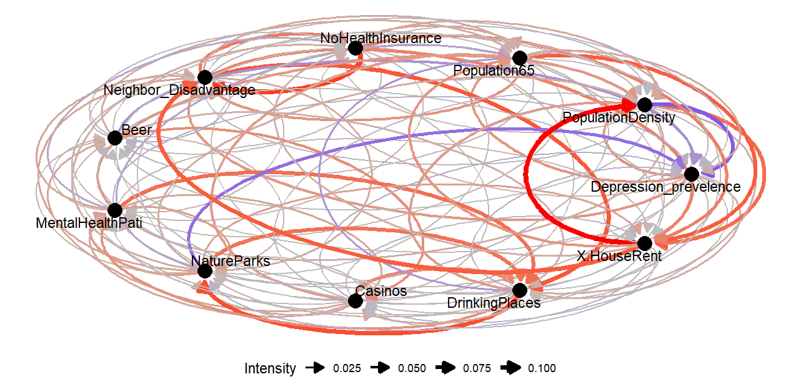

## Install and load R packages

```r
if (!requireNamespace("devtools")) {
    install.packages("devtools")
}
devtools::install_github("stscl/cisp",
                         build_vignettes = TRUE,
                         dep = TRUE)
```

```r
library(cisp)
```

## Spatial pattern correlation

Using the same data as [the gdverse idsa vignette](https://stscl.github.io/gdverse/articles/idsa.html):


``` r
depression = system.file('extdata/Depression.csv',package = 'gdverse') |>
  readr::read_csv() |>
  sf::st_as_sf(coords = c('X','Y'), crs = 4326)
## Rows: 1072 Columns: 13
## ── Column specification ───────────────────────────────────────────────────────────────────────────
## Delimiter: ","
## dbl (13): X, Y, Depression_prevelence, PopulationDensity, Population65, NoHealthInsurance, Neig...
## 
## ℹ Use `spec()` to retrieve the full column specification for this data.
## ℹ Specify the column types or set `show_col_types = FALSE` to quiet this message.
depression
## Simple feature collection with 1072 features and 11 fields
## Geometry type: POINT
## Dimension:     XY
## Bounding box:  xmin: -83.1795 ymin: 32.11464 xmax: -78.6023 ymax: 35.17354
## Geodetic CRS:  WGS 84
## # A tibble: 1,072 × 12
##    Depression_prevelence PopulationDensity Population65 NoHealthInsurance Neighbor_Disadvantage
##  *                 <dbl>             <dbl>        <dbl>             <dbl>                 <dbl>
##  1                  23.1              61.5         22.5              7.98               -0.0525
##  2                  22.8              58.3         16.8             11.0                -0.254 
##  3                  23.2              35.9         24.5              9.31               -0.0540
##  4                  21.8              76.1         21.8             13.2                 0.0731
##  5                  20.7              47.3         22.0             11                   0.763 
##  6                  21.3              32.5         19.2             13.0                 0.422 
##  7                  22                36.9         19.2             10.8                 0.113 
##  8                  21.2              61.5         15.9              8.57               -0.154 
##  9                  22.7              67.2         15.7             17.8                -0.320 
## 10                  20.6             254.          11.3             12.7                 0.457 
## # ℹ 1,062 more rows
## # ℹ 7 more variables: Beer <dbl>, MentalHealthPati <dbl>, NatureParks <dbl>, Casinos <dbl>,
## #   DrinkingPlaces <dbl>, X.HouseRent <dbl>, geometry <POINT [°]>
```


``` r
system.time({
  g = cisp::spc(depression,cores = 12)
})
##    user  system elapsed 
##    5.84    1.20 2081.24
g
## ***   Spatial Pattern Correlation    
## 
## |          yv           |          xv           |  correlation  |
## |:---------------------:|:---------------------:|:-------------:|
## | Depression_prevelence |   PopulationDensity   | 4.613992e-02  |
## | Depression_prevelence |     Population65      | 4.150478e-02  |
## | Depression_prevelence | Neighbor_Disadvantage | 3.924159e-02  |
## | Depression_prevelence |    DrinkingPlaces     | 1.485115e-02  |
## | Depression_prevelence |   NoHealthInsurance   | 1.384179e-02  |
## | Depression_prevelence |      NatureParks      | 1.238754e-02  |
## | Depression_prevelence |   MentalHealthPati    | 1.041791e-02  |
## | Depression_prevelence |      X.HouseRent      | 7.768505e-03  |
## | Depression_prevelence |         Beer          | 1.914223e-03  |
## | Depression_prevelence |        Casinos        | -7.083083e-03 |
## |   PopulationDensity   |      X.HouseRent      | 7.832439e-02  |
## |   PopulationDensity   |   MentalHealthPati    | 1.587098e-02  |
## |   PopulationDensity   |    DrinkingPlaces     | 1.483815e-02  |
## |   PopulationDensity   |     Population65      | 1.037345e-02  |
## |   PopulationDensity   |   NoHealthInsurance   | 6.187618e-03  |
## |   PopulationDensity   |      NatureParks      | 5.277059e-03  |
## |   PopulationDensity   |         Beer          | 1.149474e-03  |
## |   PopulationDensity   |        Casinos        | 1.075641e-03  |
## |   PopulationDensity   | Neighbor_Disadvantage | -5.290491e-03 |
## |   PopulationDensity   | Depression_prevelence | -7.737254e-02 |
## |     Population65      |      X.HouseRent      | 8.942427e-02  |
## |     Population65      | Neighbor_Disadvantage | 4.196298e-02  |
## |     Population65      |   PopulationDensity   | 2.396500e-02  |
## |     Population65      | Depression_prevelence | 2.230939e-02  |
## |     Population65      |   MentalHealthPati    | 5.615720e-03  |
## |     Population65      |    DrinkingPlaces     | 3.487904e-03  |
## |     Population65      |   NoHealthInsurance   | 3.461840e-03  |
## |     Population65      |         Beer          | -5.285474e-03 |
## |     Population65      |      NatureParks      | -7.663094e-03 |
## |     Population65      |        Casinos        | -9.763578e-03 |
## |   NoHealthInsurance   | Neighbor_Disadvantage | 1.105041e-01  |
## |   NoHealthInsurance   |      X.HouseRent      | 6.270303e-02  |
## |   NoHealthInsurance   |     Population65      | 2.928277e-02  |
## |   NoHealthInsurance   |   PopulationDensity   | 2.298465e-02  |
## |   NoHealthInsurance   |    DrinkingPlaces     | 1.301730e-02  |
## |   NoHealthInsurance   |        Casinos        | 7.750685e-03  |
## |   NoHealthInsurance   |   MentalHealthPati    | 6.574109e-03  |
## |   NoHealthInsurance   |         Beer          | 4.335673e-03  |
## |   NoHealthInsurance   |      NatureParks      | 1.970191e-03  |
## |   NoHealthInsurance   | Depression_prevelence | -7.785626e-03 |
## | Neighbor_Disadvantage |    DrinkingPlaces     | 9.368817e-02  |
## | Neighbor_Disadvantage |   NoHealthInsurance   | 6.839594e-02  |
## | Neighbor_Disadvantage |      X.HouseRent      | 6.003962e-02  |
## | Neighbor_Disadvantage |      NatureParks      | 1.923556e-02  |
## | Neighbor_Disadvantage |     Population65      | 1.866523e-02  |
## | Neighbor_Disadvantage |   MentalHealthPati    | 1.156848e-02  |
## | Neighbor_Disadvantage |        Casinos        | 5.412816e-03  |
## | Neighbor_Disadvantage |   PopulationDensity   | -3.565453e-03 |
## | Neighbor_Disadvantage | Depression_prevelence | -6.645998e-03 |
## | Neighbor_Disadvantage |         Beer          | -9.891279e-03 |
## |         Beer          |        Casinos        | 4.989166e-02  |
## |         Beer          |     Population65      | 1.780223e-02  |
## |         Beer          |    DrinkingPlaces     | 1.468898e-02  |
## |         Beer          |      NatureParks      | 1.294840e-02  |
## |         Beer          | Neighbor_Disadvantage | 3.307984e-03  |
## |         Beer          |   PopulationDensity   | 2.113110e-03  |
## |         Beer          |   MentalHealthPati    | 1.609752e-03  |
## |         Beer          |      X.HouseRent      | -1.571509e-04 |
## |         Beer          |   NoHealthInsurance   | -3.058150e-03 |
## |         Beer          | Depression_prevelence | -3.498701e-02 |
## |   MentalHealthPati    |    DrinkingPlaces     | 7.589759e-02  |
## |   MentalHealthPati    |   PopulationDensity   | 3.784925e-02  |
## |   MentalHealthPati    |      NatureParks      | 3.207796e-02  |
## |   MentalHealthPati    | Neighbor_Disadvantage | 2.471292e-02  |
## |   MentalHealthPati    |        Casinos        | 2.460031e-02  |
## |   MentalHealthPati    |         Beer          | 1.056623e-02  |
## |   MentalHealthPati    |     Population65      | 9.823873e-03  |
## |   MentalHealthPati    |      X.HouseRent      | 7.990203e-03  |
## |   MentalHealthPati    | Depression_prevelence | -1.048828e-02 |
## |   MentalHealthPati    |   NoHealthInsurance   | -1.680511e-02 |
## |      NatureParks      |    DrinkingPlaces     | 7.348625e-02  |
## |      NatureParks      |   MentalHealthPati    | 3.485657e-02  |
## |      NatureParks      |      X.HouseRent      | 2.806660e-02  |
## |      NatureParks      | Neighbor_Disadvantage | 2.704057e-02  |
## |      NatureParks      |   PopulationDensity   | 1.845508e-02  |
## |      NatureParks      |   NoHealthInsurance   | 1.688694e-02  |
## |      NatureParks      |         Beer          | 1.029185e-02  |
## |      NatureParks      |        Casinos        | 8.421471e-03  |
## |      NatureParks      |     Population65      | -1.960554e-02 |
## |      NatureParks      | Depression_prevelence | -6.236815e-02 |
## |        Casinos        |    DrinkingPlaces     | 5.319214e-02  |
## |        Casinos        |     Population65      | 3.493616e-02  |
## |        Casinos        |         Beer          | 2.487624e-02  |
## |        Casinos        |      NatureParks      | 1.989072e-02  |
## |        Casinos        |   MentalHealthPati    | 1.853764e-02  |
## |        Casinos        | Neighbor_Disadvantage | 2.927941e-03  |
## |        Casinos        |   NoHealthInsurance   | 8.801613e-05  |
## |        Casinos        |   PopulationDensity   | -2.072731e-03 |
## |        Casinos        |      X.HouseRent      | -8.640315e-03 |
## |        Casinos        | Depression_prevelence | -1.343536e-02 |
## |    DrinkingPlaces     |      NatureParks      | 1.000035e-01  |
## |    DrinkingPlaces     |   MentalHealthPati    | 4.481903e-02  |
## |    DrinkingPlaces     |   PopulationDensity   | 3.366277e-02  |
## |    DrinkingPlaces     |        Casinos        | 2.221974e-02  |
## |    DrinkingPlaces     |         Beer          | 1.329771e-02  |
## |    DrinkingPlaces     |   NoHealthInsurance   | 2.575281e-03  |
## |    DrinkingPlaces     |      X.HouseRent      | 1.852861e-03  |
## |    DrinkingPlaces     | Neighbor_Disadvantage | -3.999435e-03 |
## |    DrinkingPlaces     | Depression_prevelence | -1.161842e-02 |
## |    DrinkingPlaces     |     Population65      | -3.072434e-02 |
## |      X.HouseRent      |   PopulationDensity   | 1.249357e-01  |
## |      X.HouseRent      | Neighbor_Disadvantage | 8.995114e-02  |
## |      X.HouseRent      |     Population65      | 4.226893e-02  |
## |      X.HouseRent      |   NoHealthInsurance   | 1.481202e-02  |
## |      X.HouseRent      |    DrinkingPlaces     | 6.673956e-03  |
## |      X.HouseRent      |   MentalHealthPati    | -1.753068e-03 |
## |      X.HouseRent      |        Casinos        | -5.807954e-03 |
## |      X.HouseRent      | Depression_prevelence | -5.869152e-03 |
## |      X.HouseRent      |         Beer          | -6.924018e-03 |
## |      X.HouseRent      |      NatureParks      | -1.046909e-02 |
plot(g)
## Warning: `guide_colourbar()` cannot be used for edge_colour.
## ℹ Use one of colour, color, or fill instead.
```


