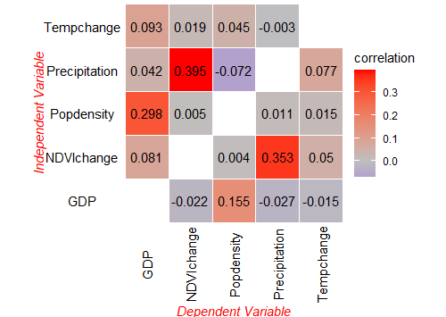

## Install and load R packages

```r
install.packages("cisp", dep = TRUE)
```

```r
library(cisp)
```

## Spatial pattern correlation

Using the same data as [the gdverse opgd vignette](https://stscl.github.io/gdverse/articles/opgd.html). Since the `spc` function in CISP requires all input variables to be continuous, only continuous variables are retained in the data:


``` r
ndvi = gdverse::ndvi
ndvi
## # A tibble: 713 × 7
##    NDVIchange Climatezone Mining Tempchange Precipitation    GDP Popdensity
##         <dbl> <chr>       <fct>       <dbl>         <dbl>  <dbl>      <dbl>
##  1    0.116   Bwk         low         0.256          237.  12.6      1.45  
##  2    0.0178  Bwk         low         0.273          214.   2.69     0.801 
##  3    0.138   Bsk         low         0.302          449.  20.1     11.5   
##  4    0.00439 Bwk         low         0.383          213.   0        0.0462
##  5    0.00316 Bwk         low         0.357          205.   0        0.0748
##  6    0.00838 Bwk         low         0.338          201.   0        0.549 
##  7    0.0335  Bwk         low         0.296          210.  11.9      1.63  
##  8    0.0387  Bwk         low         0.230          236.  30.2      4.99  
##  9    0.0882  Bsk         low         0.214          342. 241       20.0   
## 10    0.0690  Bsk         low         0.245          379.  42.0      7.50  
## # ℹ 703 more rows
ndvi = dplyr::select(ndvi,-c(Climatezone,Mining))
ndvi
## # A tibble: 713 × 5
##    NDVIchange Tempchange Precipitation    GDP Popdensity
##         <dbl>      <dbl>         <dbl>  <dbl>      <dbl>
##  1    0.116        0.256          237.  12.6      1.45  
##  2    0.0178       0.273          214.   2.69     0.801 
##  3    0.138        0.302          449.  20.1     11.5   
##  4    0.00439      0.383          213.   0        0.0462
##  5    0.00316      0.357          205.   0        0.0748
##  6    0.00838      0.338          201.   0        0.549 
##  7    0.0335       0.296          210.  11.9      1.63  
##  8    0.0387       0.230          236.  30.2      4.99  
##  9    0.0882       0.214          342. 241       20.0   
## 10    0.0690       0.245          379.  42.0      7.50  
## # ℹ 703 more rows
```


``` r
system.time({
  g = cisp::spc(ndvi,cores = 6)
})
##    user  system elapsed 
##    0.66    0.26   24.88
g
## ***   Spatial Pattern Correlation    
## 
## |      xv       |      yv       | correlation |
## |:-------------:|:-------------:|:-----------:|
## | Precipitation |  NDVIchange   |   0.39517   |
## |  Tempchange   |  NDVIchange   |   0.01905   |
## |  Popdensity   |  NDVIchange   |   0.00483   |
## |      GDP      |  NDVIchange   |  -0.02158   |
## | Precipitation |  Tempchange   |   0.07679   |
## |  NDVIchange   |  Tempchange   |   0.04977   |
## |  Popdensity   |  Tempchange   |   0.01516   |
## |      GDP      |  Tempchange   |  -0.01466   |
## |  NDVIchange   | Precipitation |   0.35303   |
## |  Popdensity   | Precipitation |   0.01140   |
## |  Tempchange   | Precipitation |  -0.00265   |
## |      GDP      | Precipitation |  -0.02745   |
## |  Popdensity   |      GDP      |   0.29824   |
## |  Tempchange   |      GDP      |   0.09282   |
## |  NDVIchange   |      GDP      |   0.08061   |
## | Precipitation |      GDP      |   0.04213   |
## |      GDP      |  Popdensity   |   0.15481   |
## |  Tempchange   |  Popdensity   |   0.04483   |
## |  NDVIchange   |  Popdensity   |   0.00442   |
## | Precipitation |  Popdensity   |  -0.07190   |
```

The results are visualized in a default network graph style:


``` r
plot(g)
```


But the results can also be plotted using the classic correlation coefficient matrix visualization style:


``` r
plot(g,style = "matrix")
```


